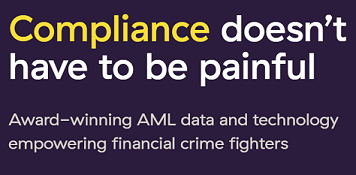
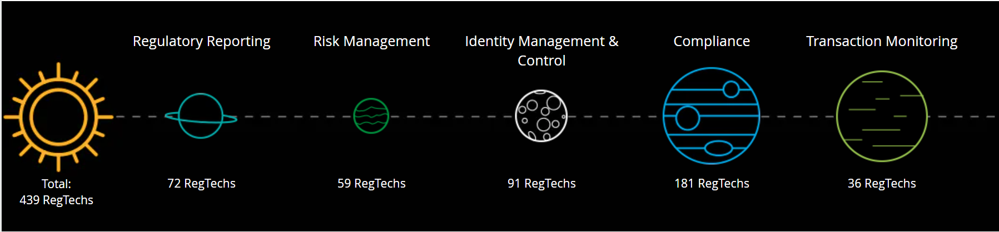
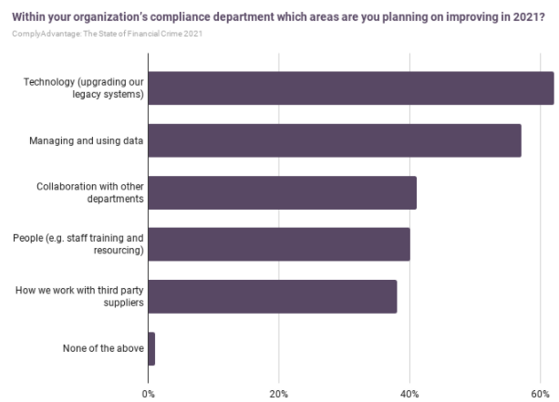

# ComplyAdvantage RegTech Case Study

```py
Unit One Homework Assignment: FinTech Case Study
Domain: Regulation Technology (RegTech)
Company: ComplyAdvantage
Author: Rachel Pierce
Date:  September 2021
```
  
## Overview and Origin  
     

  

**ComplyAdvantage** is an AI-driven risk management database for companies that can potentially be hurt by financial crime.  The company's proprietary Anti-Money Launder (AML) data feed creates profiles, automates customer monitoring with KYC and due diligence tools and screens payments in real-time.  The ComplyAdvantage platform is currently used by more than 500 companies in money-transferring industries, including payments, stock trading, and even gambling, across 75 countries.

ComplyAdvantage was born out of the frustration experienced by founder Charles Delingpole while evaluating AML data providers.  With cybercrime, fraud, and money laundering on the rise, an effective AML program was absolutely essential.   But despite trying numerous tools, Charles felt like they were too difficult to integrate, were hard to use, and provided too many false positive alerts.  ComplyAdvantage was founded in 2014 and automated AML data generation, which required technical architecture, cutting-edge AI, and hundreds of developers, data scientists, and financial crime professionals.




   
ComplyAdvantage has over 500 customers, including some of the world's leading companies such as robinhood, affirm, Santander, and Paxos, and results have been very positive.  After implementation, Santander was able to reduce onboarding time by 80%, Paxos improved their efficiency by 80%, and IPT Africa's false positives were reduced by 60%.  

The company's competitive advantage includes their proprietary data, which is used to better segment and screen data according to the customer's risk appetite, and it is designed to provide all the functionality the customer needs to integrate into their AML processes.  There are no legacy technology issues to deal with and it includes easy to understand and transparent API documentation.  The customer is able to get set up in hours, not months.


Well-known investors and industry experts are helping guide the path, including Index Ventures, Balderton Capital, and Ontario Teachers' Pension Plan.  The company has received total funding of $108.2 million (series C) from five total investors, with $20 million last raised four months ago.

   
## **Landscape**
  
ComplyAdvantage operates with the Regulatory Technology (RegTech) domain, specifically within the Compliance RegTech category.

According to Deloitte, there are around 220 regulatory revisions to keep track of daily, and regulatory fines have exceeded $345 billion since 2009.  Compliance costs continue to increase substantially, with some smaller companies not able to afford a compliance program that meets regulatory expectations.  This has created RegTech, which are companies that provide technology-based solutions to address regulatory challenges.  RegTech uses technologies to facilitate meeting compliance and regulatory requirements and create a source of competitive differentiation.  RegTech harnesses the power of big data, AI, and blockchain to reduce financial risk, increase regulatory compliance, and stamp out laundering and fraud - all of which contribute to an estimated $2 trillion yearly loss for the global economy.

Main technologies supporting RegTech include:
- Cloud Computing
- Blockchain
- Application Program Interface
- Machine Learning
- Big Data
- Data Mining & Analytics
- Predictive Analysis
- Smart Contracts
- Visualization Solutions

Deloitte started tracking the RegTech Universe four years ago, which has grown from 150 to more than 400 solutions and their universe continues to expand.  More and more companies are using RegTech products and services to help them overcome compliance and regulatory hurdles.  Banks are able to use solutions to increase the quality of their risk management, reduce compliance costs, or automate onboarding processes.  Deloitte identified five main categories within the RegTech Universe:



The number one category is compliance at 41%.  While Deloitte's list is not all inclusive of every RegTech in the market, the data is helpful in showing the main categories within the RegTech world and how they compare, and also how this world continues to expand.  Given the significant amount of regulatory changes that will take place as governments seek to respond to new financial technologies, including virtual assets, and promote the use of technology to tackle financial crime, this industry will continue to grow and regulatory expectations will continue to rise.  The need for smart compliance solutions will only increase.

With the heightened expectation for companies to monitor potential risk, detect fraud, and run day-to-day operations, more and more RegTech companies are making their way into customer hands.  The relatively young RegTech market is on track to reach $16 billion by 2025 and $22 billion by 2027.  A few of the top RegTech startups according to explodingtopics.com are:
1. Chainanalysis (AML and risk detection solutions provider for blockchains)
2. Behavox (Offers a collection of risk and compliance-related solutions for enterprises)
1. ComplyAdvantage (Offers AML solutions to financial institutions)
2. Tookitaki (compliance platform as a service company)
1. Ascent (Cloud-based regulatory compliance software for financial businesses, banks, law firms, and asset management companies)


  
## **Results**
   
In a 24-hour span, ComplyAdvantage's AML database can analyze five million news articles across 200 countries and update 30,000 KYC profiles.  This has provided live financial crime insight, screening against the cleanest risk data, 24/7 monitoring, and easy integration.  Payments can be processed faster and onboarding time can be cut in half.

The company has won multiple awards, including the XCelent Advanced Technology Award, LIBF Best Innovation For Corporate Onboarding, and the Sunday Times Tech Track Digital Innovation Award.

Success is measured by improvements in client operating efficiencies and onboarding time.  As mentioned earlier, using ComplyAdvantage products and services Santander was able to reduce onboarding time by 80%, Paxos improved their efficiency by 80%, and IPT Africa's false positives were reduced by 60%.  

ComplyAdvantage appears to perform well compared to peer.  In terms of revenue, ComplyAdvantage compares favorably to its competitors (using competitor listing from growjo.com).  2019 annual revenue for ComplyAdvantage was $33.2M, which ranks
7th highest vs the 15 competitors listed on growjo.

   
## **Case Study Recommendations**
   
I recommend that ComplyAdvantage expand their product offering and services outside of AML/KYC to other compliance areas/regulations, such as compliance with Fair Lending laws.  This would benefit the company by helping to automate and provide more efficient data analysis to its clients who are also required to comply with these other high-profile regulations that may be manual and time consuming.  This additional product would likely require the same type of technologies already used in the AML software, so it would seem fairly easy to implement by changing the data requirements and parameters within the software.  For example, instead of screening data for money laundering or fraud, they could screen data for redlining or unfair or deceptive practices against prohibited basis groups, such as race.  This technology could dramatically improve the analysis that is required for various Fair Lending regulations as well as for other manually intensive regulations such as the Consumer Reinvestment Act.

According to ComplyAdvantage's State of Financial Crime 2021 report, survey results showed that the number one area within an organization's compliance department that the company planned to improve in 2021 was technology.  With this demand, the expansion of ComplyAdvantage's products to other regulations could be a very successful strategy.



  
## **Additional Notes**
   
During my research, I found various articles regarding the stubbornness of banks when it comes to working with FinTechs.  Many state it's not a level playing field, but now is the time for financial institutions to collaborate with FinTechs to provide better solutions to customers and create efficiencies.  According to Forbes, "The harsh reality is that fintechs have moved 'from disruption to reality,' and banks that haven't embraced effective collaboration with startups are struggling to retain and acquire new customers."  The Forbes article continues to mention that only 19% of banks have a dedicated innovation team, which supports the fact that banks need to start collaborating with FinTech companies to make their operations more efficient and their products/services better and more innovative.  Forbes uses Santander as an example - Santander worked with several FinTechs, including ComplyAdvantage, and they have saved millions.  It will be interesting to see what the future holds for both FinTechs and banks, especially when it comes to RegTech which can make the painful compliance process easier.  As ComplyAdvantage states, "Compliance doesn't have to be painful."  It's time for banks to jump on board.


   
## **References**
  
[ComplyAdvantage Company Website](https://complyadvantage.com/)


[ComplyAdvantage Blog](https://complyadvantage.com/blog/)

[The State of Financial Crimes 2021](https://complyadvantage.com/resource-hub/type/guide/the-state-of-financial-crime-2021/?fincrime21=fincrime21614014693b66d)

[Deloitte RegTech Universe 2021](https://www2.deloitte.com/lu/en/pages/technology/articles/regtech-companies-compliance.html) and "RegTech Business Cases 2021 Report"

[builtin BETA website](https://builtin.com/fintech/regtech-companies)


[20 RegTech Startups on the Rise in 2021](https://explodingtopics.com/blog/regtech-startups)


[CBInsights](https://www.cbinsights.com/company/complyadvantage)

[Forbes Articles](https://www.forbes.com/sites/tomgroenfeldt/2020/05/07/banks-avoid-fintechs-at-their-peril--leaders-learn-how-to-collaborate/?sh=7ec0bffa42a2)

[GrowJo ComplyAdvantage Competitors, Revenue, Alternatives and Pricing](https://growjo.com/company/ComplyAdvantage)